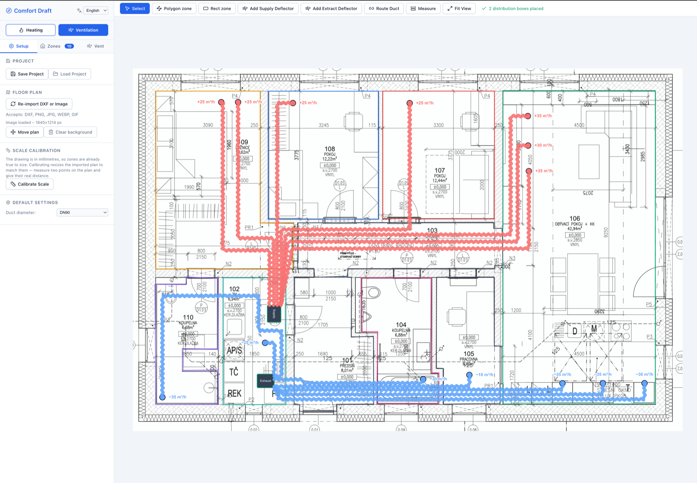
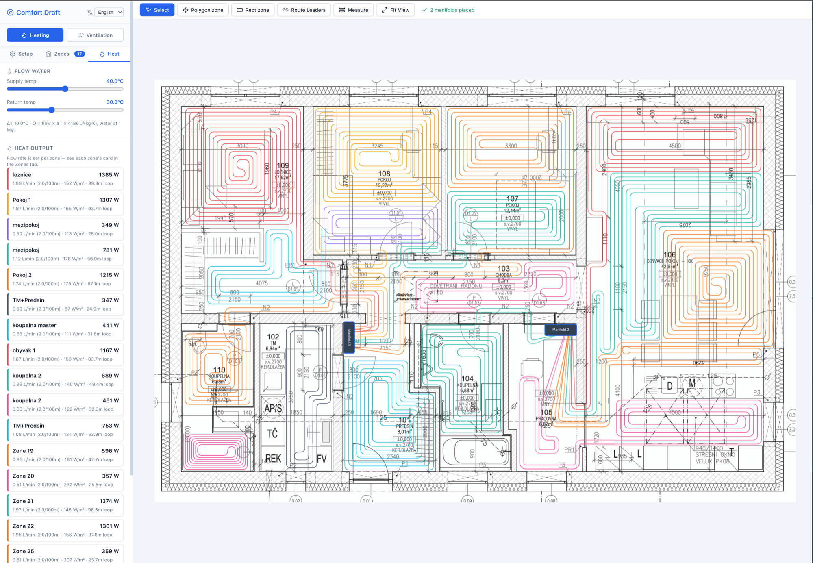

<div align="center">

<!-- GitHub swaps these by the reader's theme. -->
<picture>
  <source media="(prefers-color-scheme: dark)" srcset=".github/banner-dark.png">
  <source media="(prefers-color-scheme: light)" srcset=".github/banner-light.png">
  
</picture>

[](LICENSE)
[](#tech-stack)

</div>

# Comfort Draft

Design underfloor (radiant floor) heating circuits **and** ventilation duct layouts in
the browser, in one tool: import a floor plan, draw your rooms, and get real pipe or
duct routing with length, heat-output and airflow numbers you can actually build from.

**No install, no account, nothing uploaded** — everything runs entirely client-side.
You can try it out on [co-draft.eu](https://co-draft.eu).

Free and open source, built on top of [Arend Jan Kramer's Underfloor Heating
Designer](https://github.com/ArendJanKramer/underfloor-heating-designer) (see
[Origin](#origin) below).

## Screenshots

<table>
<tr>
<td width="50%">



**Heating** — place multiple manifolds, route each room's spiral back to whichever one
it belongs to, and read live length, flow, and heat-output-per-zone numbers as you draw.

</td>
<td width="50%">



**Ventilation** — route supply (red) and extract (blue) ducts from each deflector to a
distribution box, with per-deflector airflow shown right on the plan.

</td>
</tr>
</table>

## Two workspaces

The side panel switches between two independent design modes — each with its own
zones, tools, and totals, sharing only the floor plan and calibration underneath.

### 🔥 Heating

- **Multi-manifold support** — place any number of manifolds; a zone connects to
  whichever one its leaders are routed to
- **Zone creation** — freeform polygon (click vertices, double-click to close) or
  axis-aligned rectangle (click two opposite corners)
- **Boundary editing** — drag zone vertices in place after the fact
- **Per-zone spacing, padding, connection corner and start direction** — pick which
  corner the supply/return connect near, and whether the spiral leaves the manifold
  running horizontally or vertically
- **Rectilinear serpentine spirals**, auto-generated inside each zone from
  horizontal/vertical runs joined by rounded, pipe-radius-aware U-turns; drag individual
  spiral corners to nudge the auto-generated fill, with a one-click reset back to it
- **Manual leader routing** — click-to-route the supply/return pipe from a zone back to
  a manifold, snapped to horizontal/vertical runs, or let it end open with no manifold
- **Length, flow and heat output per zone** — with over-length circuit warnings, total
  system water volume, and a pipe-size picker (16/17/18/20 mm)

### 🌬️ Ventilation

- **Vent zones** — the same polygon/rectangle drawing tools, used to outline rooms so
  deflectors placed inside are counted automatically
- **Supply and extract deflectors** — placed as points, each with its own airflow
  (m³/h) and a configurable label position
- **Distribution boxes** and **manual duct routing** — click-to-route ducts from a
  deflector back to a box, rendered as a flexible-duct zigzag symbol
- **Balancing** — set the ventilation unit's own rated total exchange, and get warned
  if the supply or extract side drifts too far from it
- **Duct diameter picker** (75/90 mm)

### Shared across both

- **Background import** — raster image (PNG, JPG, WEBP, GIF) or DXF as the floor-plan
  reference layer, with pan/zoom and scale calibration (click two points, enter the
  real-world distance)
- **Save / load project** — exports the full design to a JSON file and back
- **Tape measure** tool for one-off distance checks
- **Language selector** — English, German, and Czech, switchable at any time from the
  side panel header

## Tech Stack

- **Vite** + **React** + **TypeScript**
- **react-konva** / **konva** — Interactive 2D canvas
- **zustand** — State management, persisted to `localStorage`
- **i18next** / **react-i18next** — Translations (English, German, Czech)
- **dxf-parser** — DXF file parsing
- **clipper-lib** — Polygon offset/clipping
- **Vitest** — Unit tests

## Getting Started

```bash
npm install
npm run dev      # Start development server
npm run build    # Production build
npm test         # Run unit tests
```

## Usage

1. **Import background**: click "Import DXF or Image" to load a floor plan (image
   preferred; DXF also supported). The background auto-fits to the viewport.
2. **Calibrate scale**: click "Calibrate Scale", click two known points on the plan,
   then enter the real-world distance between them in millimetres.
3. **Pick a workspace**: **Heating** or **Ventilation**, from the buttons under the app
   title.
4. **Draw zones**: *Polygon zone* (click vertices, double-click to close) or *Rect
   zone* (click two opposite corners).
5. **Place hardware**: add a manifold (Heating) or a distribution box (Ventilation),
   then drag it into place.
6. **Route pipes/ducts**: select the routing tool, click the zone or deflector to start,
   click through waypoints, and finish on the manifold/box — or press Enter to leave the
   run open.
7. **Read the numbers**: the side panel's Heat or Vent tab totals length, flow, heat
   output, or airflow, live, as you draw.

## Image Import (recommended)

Raster images are the primary background workflow:

- Accepted formats: **PNG, JPG/JPEG, WEBP, GIF**
- The image is loaded via `URL.createObjectURL`, displayed on a dedicated Konva layer,
  and auto-fitted (centered + scaled to fill the viewport).
- Pan, zoom, and scale calibration all work on top of the image exactly as for DXF.

### DXF import

DXF import is retained for compatibility. Supported entity types: `LINE`,
`LWPOLYLINE`, `POLYLINE`, `CIRCLE`, `ARC`. Some DXF exporters produce entities not
covered by these types, or put all geometry at Y=0 (invisible after the Y-flip). If a
DXF renders nothing, use image import instead.

## Serpentine / Rounded-Corner Algorithm

The heating pipe fill is a **rectilinear boustrophedon** ("even-N serpentine with
U-turn arcs"):

1. **Bounding box** of the zone polygon is computed.
2. **Orientation** (vertical or horizontal passes) is chosen from which edge of the
   bounding box is nearest the manifold.
3. **Even pass count** is enforced, so the path starts and ends on the same side of the
   bounding box, near the manifold-facing edge.
4. **Rounded U-turns** at each pass end use a pipe-bend-radius-aware semicircular arc,
   keeping all geometry rectilinear-plus-arcs — no diagonals.
5. Both endpoints connect back to the manifold (or another zone's endpoint) via leader
   routing, manual or auto-snapped.
6. **Length accuracy**: path length is computed over the full polyline including arc
   segments.

Ventilation ducts use a related but separate rectilinear router
(`geometry/ductRouting.ts`), rendered with a zigzag "flex duct" symbol
(`geometry/zigzag.ts`) rather than a solid line.

## Architecture

```text
src/
  types.ts                    — Core types (Point, Zone, Manifold, VentZone, VentDeflector, ...)
  i18n/                       — i18next setup + en/de/cs translation resources
  geometry/
    spiral.ts                 — Rectilinear serpentine generation (generateSerpentine)
    spiralEditing.ts          — Dragging individual auto-generated spiral corners
    manualRouting.ts          — Manual leader-pipe routing between zones and manifolds
    manifoldRouting.ts        — Manifold layout and per-zone port assignment
    ductRouting.ts            — Manual duct routing between deflectors and distribution boxes
    zigzag.ts                 — Flex-duct zigzag rendering path
    ventZones.ts              — Point-in-polygon test used to auto-count deflectors per zone
    heat.ts                   — Flow, heat output and water-volume calculations
    offset.ts, length.ts, dxfHelpers.ts, rect.ts — Supporting geometry helpers
  pipeSpec.ts                  — Physical pipe constants (bend radius, etc.)
  state/
    store.ts                  — Zustand store: all app state and actions, persisted to localStorage
  components/
    Canvas/                   — Konva stage and layers (background, zones, manifold, leaders, vent zones, deflectors/ducts, measure)
    SidePanel/                — Setup, zone/manifold/deflector/distribution-box cards, Heat and Vent tabs, language selector
    Toolbar/, TopToolbar/      — Tool mode buttons and contextual hints
```

## Known Limitations

- **Polygon clipping**: the serpentine uses the zone's axis-aligned bounding box for
  pass extents rather than clipping to the actual polygon boundary. Accurate for
  rectangular zones; irregular polygons may see pass ends protrude slightly.
- **Concave polygons**: vertex editing and spiral generation work best for convex or
  mildly concave zones.
- **Large DXF files**: very complex DXF files may be slow to render.

## Origin

Comfort Draft started as a fork of [Underfloor Heating
Designer](https://github.com/ArendJanKramer/underfloor-heating-designer) by Arend Jan
Kramer, and builds on it with multi-manifold support, a full ventilation/duct-routing
workspace, manual spiral and duct editing, and English/German/Czech translations.

## License

Licensed under the [Apache License, Version 2.0](LICENSE).

```
Copyright 2026 Arend Jan Kramer

Licensed under the Apache License, Version 2.0 (the "License");
you may not use this file except in compliance with the License.
You may obtain a copy of the License at

    http://www.apache.org/licenses/LICENSE-2.0

Unless required by applicable law or agreed to in writing, software
distributed under the License is distributed on an "AS IS" BASIS,
WITHOUT WARRANTIES OR CONDITIONS OF ANY KIND, either express or implied.
See the License for the specific language governing permissions and
limitations under the License.
```
